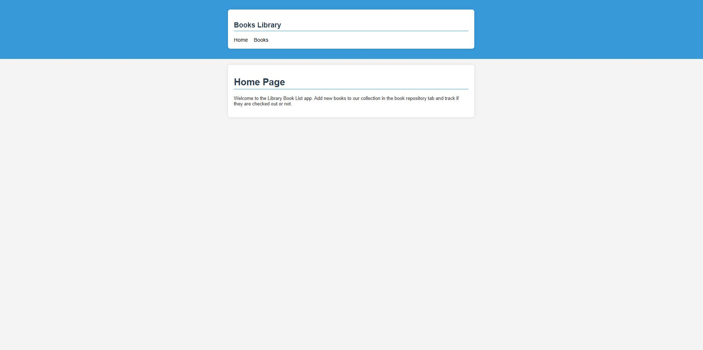
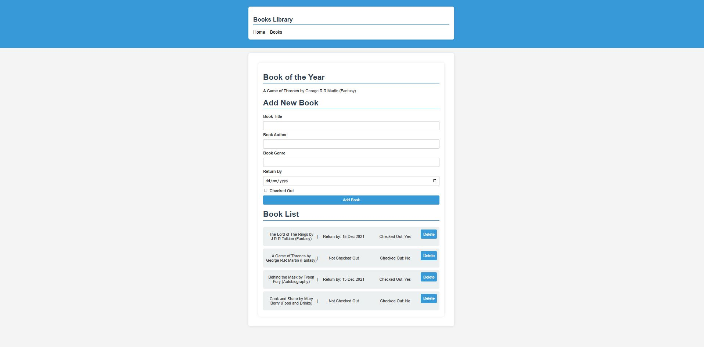

# Python Customer Orders

Flask Library Book Collection with Create & Delete functionality. 

- Python Version: 3.12.1
- Pip Version: 25.0
- Flask Version: 3.1.0

# How to start

* Install Python onto your machine.
* Install Flask
* Clone this repository.
* Navigate into the repository folder via your Termainal or IDE Terminal.
* Run ***python app.py***

# UI

Book Home Page

Book Repository
